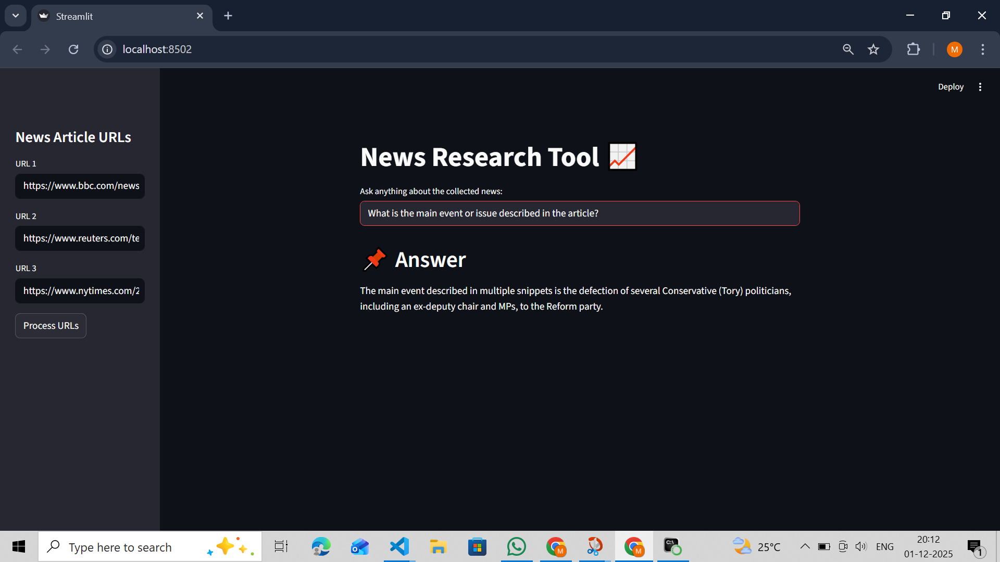
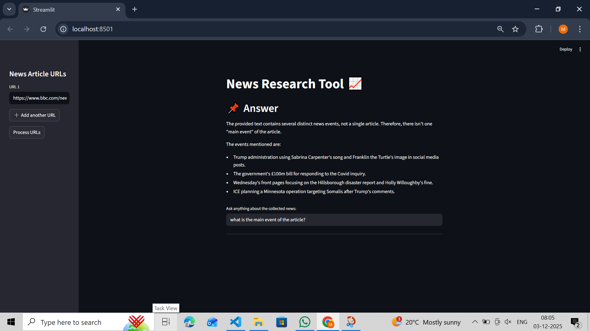

# News Research Tool

A Streamlit-based web application that allows users to research and query news articles using AI-powered analysis. The tool fetches content from multiple URLs, creates a searchable vector database, and answers questions using Google's Gemini 2.5 Flash LLM.




## Features

- **Multi-URL Processing**: Add multiple news article URLs dynamically
- **AI-Powered Analysis**: Uses Google Gemini 2.5 Flash for intelligent question answering
- **Vector Search**: FAISS-based vector store for efficient semantic search
- **Persistent Storage**: Saves processed articles for future queries
- **Interactive UI**: Clean Streamlit interface with real-time processing status

## Project Structure

```
Equity Research tool/
├── main.py                 # Main Streamlit application
├── requirements.txt        # Python dependencies
└── images/                 # Application screenshots
```

## Prerequisites

- Python 3.8+
- Google API Key (for Gemini API access)

## Installation

1. **Clone the repository**
   ```bash
   git clone <repository-url>
   cd "Equity Research tool"
   ```

2. **Install dependencies**
   ```bash
   pip install -r requirements.txt
   ```

3. **Configure environment variables**

   Create a `.env` file in the project root:
   ```
   GOOGLE_API_KEY=your_google_api_key_here
   ```

## Usage

Run the Streamlit application:
```bash
streamlit run main.py
```

**How to use:**
1. Enter news article URLs in the sidebar (click "Add another URL" for more inputs)
2. Click "Process URLs" to fetch and index the articles
3. Wait for the processing to complete
4. Ask questions about the collected news in the input field

## Technical Details

### Architecture

- **LLM**: Google Gemini 2.5 Flash (`gemini-2.5-flash`)
- **Embeddings**: Google Generative AI Embeddings (`gemini-embedding-001`)
- **Vector Store**: FAISS (Facebook AI Similarity Search)
- **Framework**: LangChain with Streamlit frontend

### Document Processing Pipeline

1. **Web Loading**: Fetches content from provided URLs using `WebBaseLoader`
2. **Text Splitting**: Chunks documents using `RecursiveCharacterTextSplitter`
   - Chunk size: 1000 characters
   - Chunk overlap: 120 characters
3. **Embedding Generation**: Creates vector embeddings using Gemini
4. **Vector Storage**: Stores embeddings in FAISS for similarity search
5. **Query Processing**: Uses RetrievalQA chain with top-k retrieval (k=2)

## Dependencies

| Package | Purpose |
|---------|---------|
| langchain | Core LLM framework |
| langchain-google-genai | Google Gemini integration |
| google-generativeai | Google AI SDK |
| faiss-cpu | Vector similarity search |
| streamlit | Web UI framework |
| python-dotenv | Environment variable management |

## Configuration

The application uses the following default settings:

- **Temperature**: 0.7 (for response creativity)
- **Retrieval k**: 2 (number of relevant chunks to retrieve)
- **Chunk size**: 1000 characters
- **Chunk overlap**: 120 characters

## License

This project is for educational and research purposes.

## Troubleshooting

**API Key Error**: Ensure your `GOOGLE_API_KEY` is correctly set in the `.env` file.

**Processing Error**: Verify that the URLs are accessible and contain readable content.

**Query Error**: Make sure to process URLs first before asking questions.
